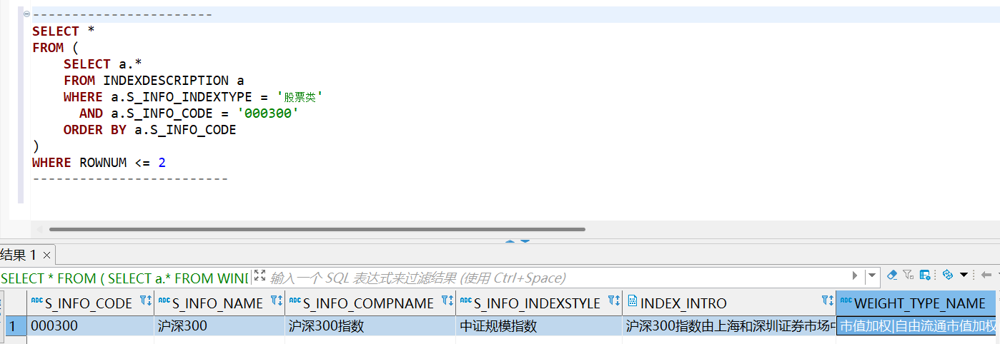
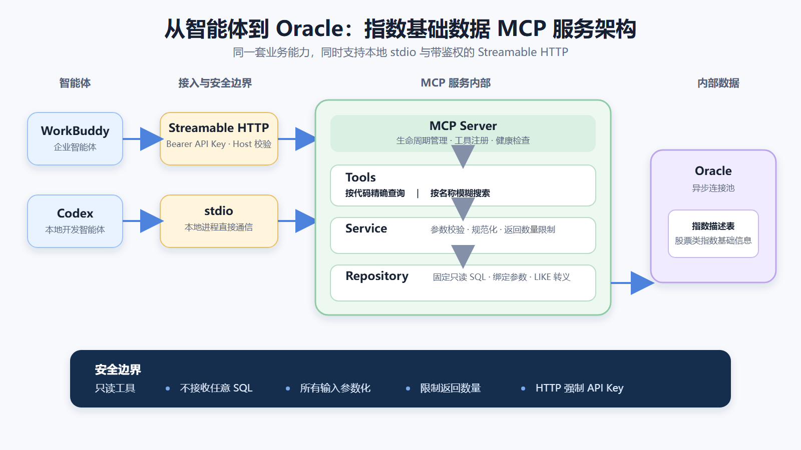
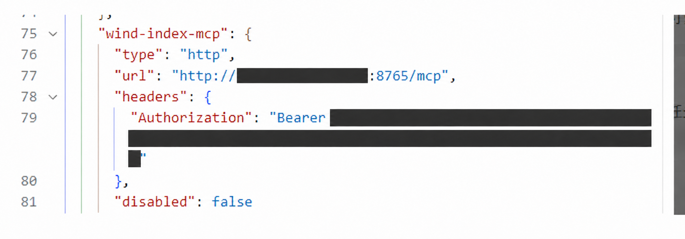
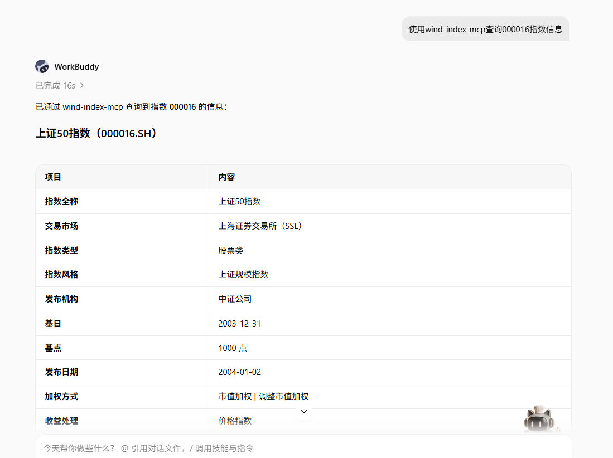
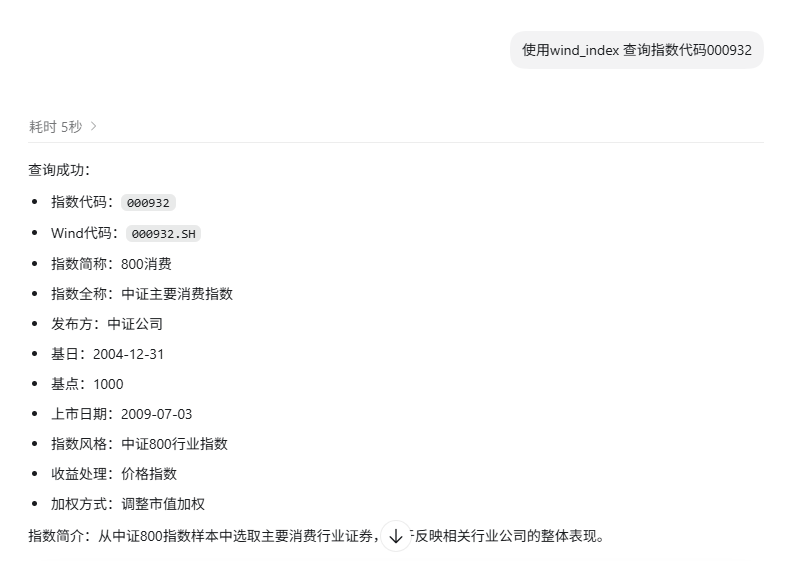

# 我把本地 Oracle 数据库，封装成了一个智能体可用的 MCP 服务

最近我在做一件比较具体的事情：我本地可以查询 Oracle 数据库，里面有不少指数基础数据，但这些数据只能由人写 SQL 去查，WorkBuddy、Codex 这样的智能体并不能直接使用。

如果只是让我自己查，这件事并不复杂。输入指数代码，执行一条 SQL，就能拿到指数名称、交易市场、发布日期、基日、基点、指数风格等信息。

*改造前，我需要进入数据库客户端，手工编写 SQL 查询指数基础信息。截图中的 SQL 用于说明原始查询方式；MCP 服务内部已经改为固定 SQL 和绑定参数，不会直接拼接用户输入。*

但如果希望智能体也能使用，问题就变了。

我不可能把数据库用户名和密码直接交给智能体，也不希望开放一个“输入任意 SQL”的万能查询接口。那样虽然看起来灵活，实际上权限范围太大，查询成本、数据边界和安全风险都无法控制。

所以这次我做的，不是让智能体连接数据库，而是把一小部分确定、可靠、只读的数据库能力，封装成一个 MCP 服务。

这篇文章主要整理一下整个项目的构建思路。具体怎么在 WorkBuddy 和 Codex 里配置、调用，我后面再结合实际使用过程单独补充。

## 一、为什么要做成 MCP

一开始也考虑过普通 HTTP API。

从技术上说，做两个 HTTP 接口当然可以：一个按代码查询，一个按名称搜索。问题是，普通 API 只是提供了一个网络地址。智能体要使用它，还需要额外知道接口的用途、参数含义、返回结构以及什么时候应该调用。

MCP 在这中间提供了一层标准化的工具协议。

服务可以明确告诉智能体：我有哪些工具、每个工具是做什么的、需要什么参数、返回什么结构，以及这些工具是不是只读、是不是会产生破坏性操作。

对智能体来说，它面对的不是一张陌生的数据表，也不是一个需要自己猜测的 HTTP 接口，而是两个边界清晰的工具。

对我来说，数据库、SQL、连接池和字段转换都留在服务内部。以后换客户端，或者增加新的智能体，不需要重新实现数据查询逻辑，只要客户端支持 MCP 就可以继续复用。

这也是我最终选择 MCP 的主要原因：它把数据库查询能力，转换成了智能体能够发现、理解和调用的业务工具。

## 二、先确定边界，再开始编码

这个项目最重要的决定，不是选择哪个 Python 库，而是先决定服务允许做什么、不允许做什么。

我最后只开放了两个工具：

- 按指数代码精确查询；
- 按指数名称模糊搜索。

除此之外，服务不接受 SQL，不提供新增、修改和删除能力，也不会让调用方决定要查询哪张表。

查询范围也固定为股票类指数。名称搜索有最大返回数量，避免一个模糊词把整张表的数据都拉出来。所有用户输入都通过绑定参数传给 Oracle，不参与 SQL 结构拼接。

名称模糊搜索还有一个容易忽略的问题：百分号和下划线在 SQL 的 LIKE 条件里本身就是通配符。如果不做转义，用户输入的内容就可能改变查询含义。所以服务会先把这些字符转义，再构造模糊匹配条件。

这样设计之后，智能体能够做的事情其实非常有限，但恰恰因为有限，服务的行为才是可预期、可验证的。

我越来越觉得，企业内部 MCP 的核心不是“给智能体更多权限”，而是“把已有能力切成足够小、足够稳定的工具”。工具越具体，数据边界越容易控制，智能体也越容易正确使用。

## 三、整体架构

整个服务的调用链并不复杂。我采用的是从传输入口到领域服务、再到数据访问的分层方式。

左侧是使用方，目前验证过 WorkBuddy 和 Codex。

中间有两种接入方式。本地智能体可以通过 stdio 启动 MCP 进程；局域网或其他机器上的智能体，可以通过 Streamable HTTP 访问。HTTP 模式会在进入 MCP 服务之前校验 Bearer API Key，并限制允许访问的 Host。

两种传输方式进入服务之后，共用同一套业务逻辑。

MCP Server 负责服务装配、生命周期和工具注册。Tools 层负责对外描述工具名称、参数和返回结构。Service 层处理输入规范化、参数校验和业务规则。Repository 层只负责执行固定的只读 SQL。最底层的 Database 模块统一管理 Oracle 异步连接池、连接超时和调用超时。

这样做的好处，是任何一层都不需要知道所有事情。

工具层不需要知道 Oracle 怎么连接；Repository 不需要关心调用来自 WorkBuddy 还是 Codex；HTTP 鉴权也不会混进指数查询的业务逻辑里。

## 四、为什么要把代码拆成这些层

如果只看当前两个查询工具，把全部逻辑写在一个文件里也能运行。但这个项目从一开始就有一个要求：后面还要支持其他表，把其他数据能力继续变成 MCP 工具。

所以我把主要代码分成了几类。

第一类是运行入口。stdio 和 HTTP 各有一个入口，它们只负责读取配置、初始化日志并选择传输方式，不处理具体查询。

第二类是 MCP 服务装配。这里负责创建服务器、启动和关闭数据库连接池、注册工具，以及提供健康检查。以后增加新领域工具，主要是在这里把新模块装配进来。

第三类是领域模块。当前是指数基础信息模块，内部再分为 tools、service、repository 和 models。tools 是对外契约，service 是业务边界，repository 是数据访问，models 负责返回结构和类型转换。

第四类是公共基础能力，包括配置、数据库连接、API Key 鉴权和日志。这些能力与具体哪张业务表无关，后续新增其他领域时可以直接复用。

以后如果要增加基金基础信息、指数成分、行情或者其他表，我不需要修改现有指数查询的内部逻辑，只需要在 domains 下面新增一个领域目录，继续使用同样的四层结构，再把新工具注册到 MCP Server。

这种结构可能比一个脚本多几个文件，但它把扩展位置提前固定下来了。每增加一张表，基本都能回答四个问题：返回什么数据、有什么业务规则、怎样安全查询、对外提供什么工具。

## 五、为什么同时支持 stdio 和 HTTP

stdio 和 HTTP 解决的是两类不同场景。

stdio 更适合本地使用。智能体客户端直接启动 MCP 进程，通过标准输入输出交换协议消息。它不需要监听端口，也不需要额外的网络鉴权，配置完成后使用体验比较直接。

HTTP 更适合把服务提供给局域网内的其他智能体，或者让多个客户端共同使用同一个服务。它不要求每个客户端都安装完整的数据库驱动和项目环境，但相应地必须增加访问控制。

我的处理方式是：HTTP 访问 MCP 路径时必须提供 Bearer API Key；服务同时启用 Host 校验，降低错误暴露和 DNS Rebinding 风险。健康检查可以不带密钥，但只返回最小的服务状态，不返回数据库、配置或版本细节。

这里有一个原则：传输方式可以不同，业务能力必须相同。

无论通过 stdio 还是 HTTP，客户端最终看到的都应该是同样的工具、参数和返回结构。这样才能保证 WorkBuddy、Codex 或后续其他智能体访问的是同一个数据能力，而不是两套逐渐分叉的实现。

## 六、接入 WorkBuddy 和 Codex

WorkBuddy 使用的是 HTTP 方式。客户端配置 MCP 地址，并在请求头中携带 Bearer API Key。下面的截图已经把内网地址和 Token 完整遮挡。

配置生效后，我可以直接用自然语言让 WorkBuddy 查询指数代码。智能体会先识别应该调用哪个 MCP 工具，再把服务返回的结构化字段整理成更适合阅读的表格。

Codex 也可以使用同一个 MCP 服务。下面是通过 Codex 查询指数代码 000932 的结果。它拿到的是同一套基础数据，只是按照自己的交互方式重新组织了展示内容。

这正是标准化工具接口的价值。MCP 服务只负责提供准确、稳定的数据，不需要为每一种智能体分别设计一套返回页面。客户端可以根据对话上下文，决定用表格、列表还是摘要来呈现。

关于 WorkBuddy 和 Codex 的具体配置方式、调用过程以及实际效果，我后面会再单独整理案例。

## 七、开发过程中遇到的几个问题

第一个问题是，`/mcp` 不是普通网页。

服务启动以后，直接在浏览器地址栏打开 MCP 路径，不一定会看到一个页面。MCP 客户端需要按照协议发起请求、初始化会话并调用工具。判断服务是否可用，不能只看浏览器有没有显示内容，应该使用 MCP 客户端或专门的冒烟测试。

第二个问题是，stdio 模式对标准输出非常敏感。

stdio 的标准输出本身就是协议通道。如果程序把普通日志、调试信息写到标准输出，客户端可能无法解析消息。所以日志应该写到标准错误，协议输出保持干净。

第三个问题是 Oracle 数据不一定能直接变成 JSON。

日期、时间、Decimal、CLOB 等类型，都需要在连接和游标还有效时完成转换。否则即使 SQL 查询成功，MCP 在返回结构化结果时也可能失败。

第四个问题是客户端配置的重新加载。

修改 MCP 配置文件之后，客户端不一定会立即重新读取。服务名称、地址、请求头或者环境变量发生变化时，通常需要重新打开工作区，甚至重启客户端。之前我遇到过服务测试完全正常，但客户端的 MCP 列表没有变化，最后就是配置没有重新加载。

第五个问题是“查询成功”并不等于“接口设计正确”。

如果只验证能不能查到一条记录，很容易忽略空参数、超长 limit、重复指数代码、LIKE 通配符、数据库暂时不可用等边界情况。MCP 工具会被智能体反复调用，这些边界必须在服务端固定下来，不能依赖客户端每次都做对。

## 八、我是怎么验证这个服务的

我把验证分成了三层。

第一层是单元测试，分别验证配置校验、API Key 鉴权、Oracle 类型转换、参数化 SQL、LIKE 转义、业务参数边界和返回结构。

第二层是 MCP 集成测试。这里不连接真实数据库，而是替换数据仓储，直接检查客户端能否发现两个只读工具，并按工具契约完成调用。

第三层是冒烟测试。stdio 和 HTTP 都通过真实 MCP 会话连接服务，再查询实际指数代码和名称，确认工具发现、数据库连接、结构化返回、API Key 和 CLOB 转换整条链路都能工作。

只有这三层都通过，我才认为这个服务真正可用。因为一个 MCP 服务不是“进程启动了”就算完成，它至少要同时满足三件事：客户端能发现工具、工具能正确访问数据、错误和权限边界符合预期。

## 九、最后的一点体会

这个项目代码量并不大，但它让我更明确了一件事：企业内部数据接入智能体，重点从来不是让模型直接看到更多数据，而是先把数据能力整理成可靠的工具。

数据库连接只是最底层的一环。真正需要设计的是：智能体可以做什么、参数范围是什么、返回结构是什么、出现异常时怎样反馈、不同客户端怎样复用，以及未来怎样继续扩展。

如果直接开放数据库，智能体得到的是一个权限过大的入口；如果封装成具体 MCP 工具，智能体得到的是一组经过约束的业务能力。

这两者看起来都能“查数据”，但安全性、可维护性和可复用性完全不同。

目前这个服务只提供指数代码精确查询和指数名称模糊搜索。后面我会继续按同样的结构扩展其他数据表，也会把 WorkBuddy、Codex 的具体配置和调用方式整理出来。

对我来说，这次实践的价值并不是多做了两个查询接口，而是跑通了一条可以重复使用的路径：

**把企业内部已有的数据能力，变成智能体能够安全调用的 MCP 工具。**
